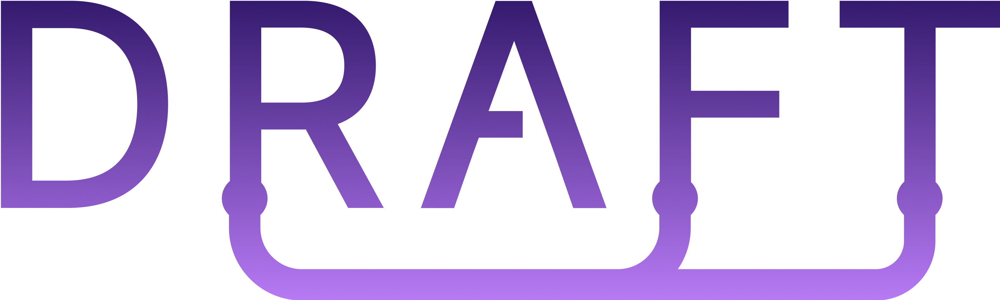
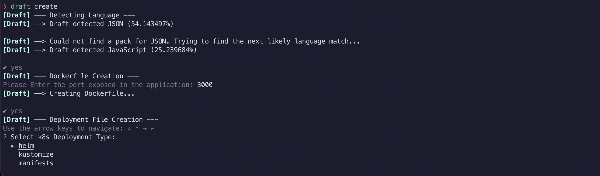
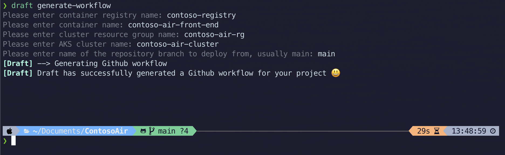
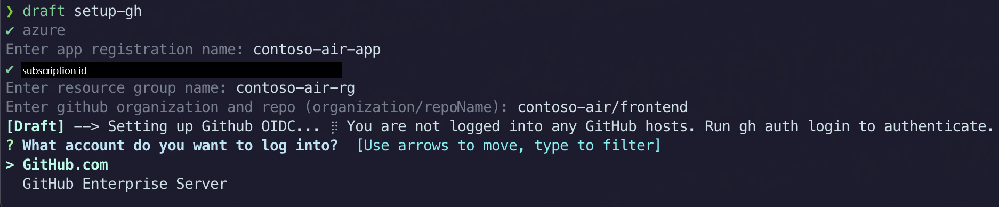
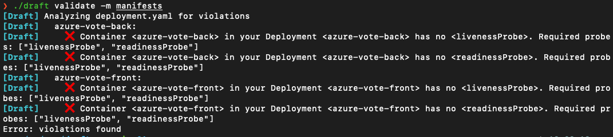

<div id="top"></div>
<br />
<div align="center">
  <h1 align="center">Draft</h1>
  <p align="center">
    A tool to help developers hit the ground running with Kubernetes.
    <br />
    <br />
    <a href="https://github.com/Azure/draft/issues">Report Bug</a>
    ·
    <a href="https://github.com/Azure/draft/issues">Request Feature</a>
  
  [](https://github.com/Azure/draft/actions/workflows/unit-tests.yml?query=branch:main)
  [](https://godoc.org/github.com/Azure/draft)
  [](https://goreportcard.com/report/github.com/Azure/draft)
  [](https://github.com/Azure/draft/actions/workflows/codeql-analysis.yml?query=branch:main)
  [](https://github.com/Azure/draft/actions/workflows/integration-linux.yml?query=branch:main)
  [](https://github.com/Azure/draft/actions/workflows/release-and-publish.yml?query=branch:main)
  </p>
</div>

## Installation
### Homebrew

1. Run the following commands

```sh
brew install draft
```

### Shell Script

```sh
curl -fsSL https://raw.githubusercontent.com/Azure/draft/main/scripts/install.sh | bash
```

* Windows is supported via WSL Ubuntu

## Getting Started

Draft is a tool made for users who are just getting started with Kubernetes or want to simplify their experience with Kubernetes. This readme will give you a quick run down on Draft’s commands and what they do.

### `draft create`

In our directory that holds our application, we can run the CLI command ‘draft create’. Draft create will walk you through a series of questions prompting you on your application specification. At the end of it, you will have a Dockerfile as well as Kubernetes manifests to deploy your application. Below is a picture of running the Draft create command on our [Contoso Air repository](https://github.com/microsoft/ContosoAir).



### `generate-workflow`

Next up, we can run the ‘draft generate-workflow’ command.
This command will automatically build out a GitHub Action for us.


### `setup-gh`

If you are using Azure, you can also run the ‘draft setup-gh’ command to automate the GitHub OIDC setup process. This process is needed to make sure your Azure account and your GitHub repository can talk to each other. If you plan on using the GitHub Action to deploy your application, this step must be completed.



At this point, you have all the files needed to deploy your application onto a Kubernetes cluster!

If you don’t plan on using the GitHub Action, you can directly apply your deployment files by using the `kubectl apply -f` command.

If you plan on deploying your application through your GitHub Action, commit all the files to your repository and watch your application get deployed!

### `draft validate`

Draft validate scans your manifests and populates warnings messages in your code terminal if your manifests are not following best practices. All best practices are sourced from AKS’s deployment safeguards feature. To learn more about deployment safeguards, visit the [offical documentation](https://learn.microsoft.com/azure/aks/deployment-safeguards). To view the best practices that are used in Draft, view the [safeguards package](https://github.com/Azure/draft/tree/main/pkg/safeguards/lib/v1.0.0).



### `draft info`
The `draft info` command prints information about supported languages and deployment types.

Example output (for brevity, only the first supported language is shown):
```
{
  "supportedLanguages": [
    {
      "name": "clojure",
      "displayName": "Clojure",
      "variableExampleValues": {
        "VERSION": [
          "8-jdk-alpine",
          "11-jdk-alpine"
        ]
      }
    }
  ]
  ...,
  "supportedDeploymentTypes": [
    "helm",
    "kustomize",
    "manifests"
  ]
}
```
<!-- ABOUT THE PROJECT -->

## About The Project

Draft makes it easier for developers to get started building apps that run on Kubernetes by taking a non-containerized application and generating the Dockerfiles, Kubernetes manifests, Helm charts, Kustomize configuration, and other artifacts associated with a containerized application. Draft can also generate a GitHub Actions workflow file to quickly build and deploy applications onto any Kubernetes cluster.

### Commands

- `draft create` adds the minimum required Dockerfile and manifest files for your deployment to the project directory.
  - Supported deployment types: Helm, Kustomize, Kubernetes manifest.
- `draft setup-gh` automates the GitHub OIDC setup process for your project.
- `draft generate-workflow` generates a GitHub Actions workflow for automatic build and deploy to a Kubernetes cluster.
- `draft update` automatically make your application to be internet accessible.
- `draft validate` scan your manifests to see if they are following Kubernetes best practices.
- `draft info` print supported language and field information in json format.

Use `draft [command] --help` for more information about a command.

### Dry Run
The following flags can be used for enabling dry running, which is currently supported by the following commands: `create`
- ` --dry-run` enables dry run mode in which no files are written to disk
-  `--dry-run-file` specifies a file to write the dry run summary in json format into

```json
// Example dry run output
{
  "variables": {
    "APPNAME": "testapp",
    "BUILDERVERSION": "null",
    "IMAGENAME": "testapp",
    "LANGUAGE": "gomodule",  // Note that this variable is in addition to the draft config variables
    "NAMESPACE": "default",
    "PORT": "1323",
    "SERVICEPORT": "80",
  },
  "filesToWrite": [
    "langtest/.dockerignore",
    "langtest/Dockerfile",
    "langtest/charts/.helmignore",
    "langtest/charts/Chart.yaml",
    "langtest/charts/production.yaml",
    "langtest/charts/templates/_helpers.tpl",
    "langtest/charts/templates/deployment.yaml",
    "langtest/charts/templates/namespace.yaml",
    "langtest/charts/templates/service.yaml",
    "langtest/charts/values.yaml"
  ]
}
```
## Install from Source

### Prerequisites

Draft requires Go version 1.21.x. or above

Check your go version.

```sh
go version
```

1. Clone the repo

   ```sh
   git clone https://github.com/Azure/draft.git
   ```

2. Change to the `draft` directory and build the binary

   ```sh
   cd draft/
   make
   ```

3. Add the binary to your path (we use the same directory as [go install](https://pkg.go.dev/cmd/go#hdr-Compile_and_install_packages_and_dependencies))

   ```sh
   mv draft $HOME/go/bin/
   ```


## Draft as a Dependency

If you are looking to leverage Draft's file generation capabilities and templating within another project instead of using the CLI, you have two options: importing the Draft go packages, and wrapping the binary

### Importing Draft Go Packages
This option will provide the cleanest integration, as it directly builds Draft into your project. However, it requires that your project is written in Go.

Dockerfiles can be generated following the example in [examples/dockerfile.go](https://github.com/Azure/draft/blob/main/example/dockerfile.go) 

Deployment files can be generated following the example in [examples/deployment.go](https://github.com/Azure/draft/blob/main/example/deployment.go)

### Wrapping the Binary
For projects written in languages other than Go, or for projects that prefer to not import the packages directly, you can wrap the Draft binary.

Several features have been implemented to make consuming draft as easy as possible:
- `draft info` prints supported language and field information in json format for easy parsing
- `--dry-run` and `--dry-run-file` flags can be used on the `create` and `update` commands to generate a summary of the files that would be written to disk, and the variables that would be used in the templates
- `draft update` and `draft create` accept a repeatable `--variable` flag that can be used to set template variables
- `draft create` takes a `--create-config` flag that can be used to input variables through a yaml file instead of interactively

## Introduction Videos

[](https://www.youtube.com/watch?v=K1VYLSm32wg&list=PLlrxD0HtieHg8On6t1l5_kj--7PMmyfGi)

[](https://www.youtube.com/watch?v=f98NDqKQRbs)

## Contributing

Draft is fully compatible with [Azure Kubernetes Service](https://docs.microsoft.com/azure/aks/draft). We strongly encourage contributions to make Draft available to other cloud providers 😊!

## Issues/Discussions

The Draft team will be monitoring both the [issues](https://github.com/Azure/draft/issues) and [discussions](https://github.com/Azure/draft/discussions) board. Please feel free to create issues for any problems you run into and the Draft team will be quick to respond. The discussions board will be used for community engagement. We look forward to see you there!

## License

Draft is under the MIT License. See [LICENSE](https://github.com/Azure/draft/blob/main/LICENSE) for more information.

## Trademark Notice

Authorized use of Microsoft trademarks or logos is subject to and must follow Microsoft’s Trademark & Brand Guidelines. Use of Microsoft trademarks or logos in modified versions of this project must not cause confusion or imply Microsoft sponsorship. Any use of third-party trademarks or logos are subject to those third-party’s policies.
